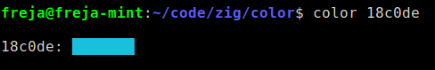
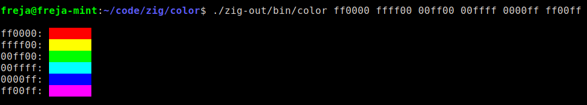

color
==========================

It lets you view colors in the terminal

### Usage:

	color ff0000 00ff00 0000ff

**OBS:** It does not support having '#' before the color values.

## Building

### Dependencies

 - zig

You'll also need an ansi 24bit color terminal to run it

### Build command:

	zig build -Doptimize=ReleaseFast

The compiled program will be in ``./zig-out/bin/``.  
Please feel free to move it  
